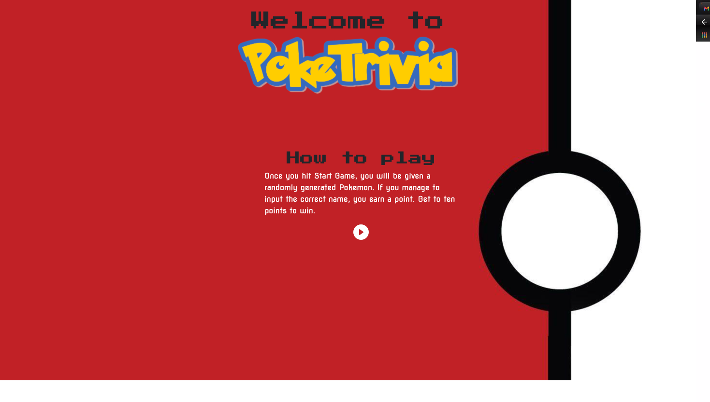
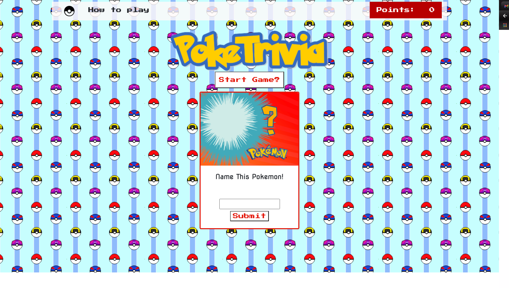

# Welcome to PokeTrivia

[PokeTrivia](https://venkatnan.github.io/Poketrivia/index.html) is a game that, upon start up will display a randomly generated pokemon. You have to try and guess that Pokemons name, 

and when you do, you get a point. once you get 10 points you win!

## Technology used
---
    * Bootstrap
    * https://fontmeme.com/pokemon-font/
    * Javascript
    * Html
    * Css

 ## About
 ---
    * As a creater, I want players to be able to see the rules before playing
    * As a user, I want to be able to see my current points
    * As a user I want to be able to check the rules whenever I want
    * As a user, I want to know when i've entered a wrong answer.

 ## Process
 ---

    While making this app, I made sure I planned out what exactly I wanted to do, and what the minimum viable product(MVP) was.
    I had exams the entire first week of the project, and because of that I wanted to make sure I had a good base so I could complete the project on time.

## Icebox
---
    * I wanted Users to have hints
    * A timer, where users get more points the quicker they answer
    * three levels with rising difficulty. each level has a different set of pokemon.
    * players have to know types and moves, not just names.

##